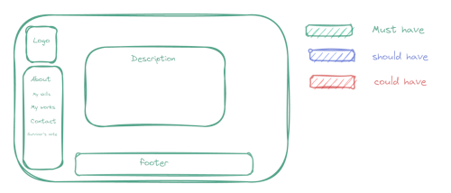
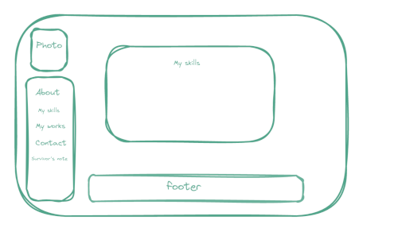
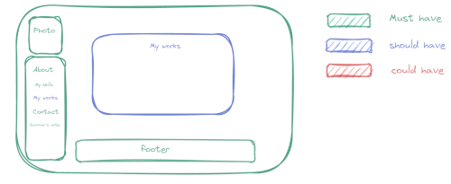
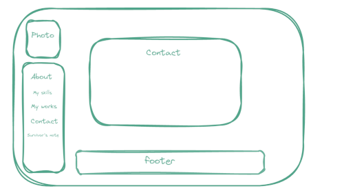
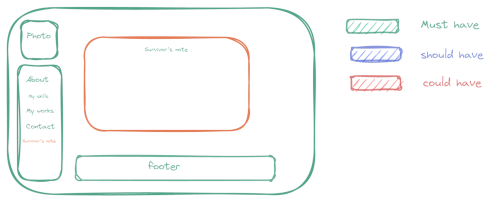

# Design

## Project's design overview

> Give an overview of your project's design

<!-- give an overview of your project's design -->
<!-- describe the reasoning behind your group's design and wireframe -->
<!-- include other centralized decisions like fonts, palates, ... -->

### Home page

### My skills page

### My works

### Contact

### Blog

---

## Wireframe(s)

> Include your wireframe(s) and link to wireframe

<!-- provide a link to your wireframe documenting on Figma, or wherever it is -->

[excalidraw.com](https://excalidraw.com/#json=E5q-PykGnJpHtVXpKE-EH,NFtg98lxtsn29Qj9wlRUSg)
